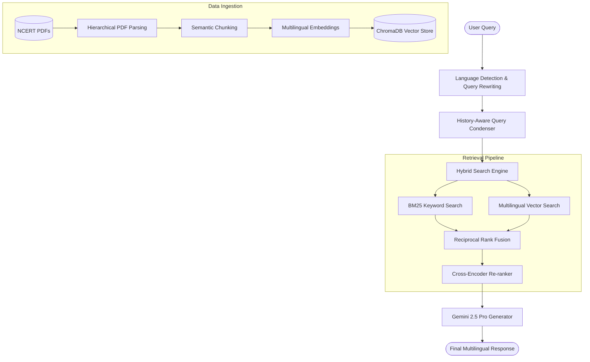

# 🚀 Roadmap: Elevating NCERT-Mitra for Your Resume

This roadmap outlines strategic enhancements to transition **NCERT-Mitra** from a basic Retrieval-Augmented Generation (RAG) prototype into an enterprise-grade, high-performance, and **multilingual** AI assistant. Implementing these features will showcase advanced AI/LLM engineering skills, search retrieval expertise, and production-ready design practices on your resume.

---

## 🗺️ Architectural Vision

---

## 🛠️ The 5-Phase Enhancement Plan

### Phase 1: True Multilingual Support (Core Identity)
*Currently, the codebase uses an English-only embedding model (`all-MiniLM-L6-v2`) and does not process queries in other languages.*

*   **Upgrade Embeddings:** Swap `all-MiniLM-L6-v2` for a multilingual model like `paraphrase-multilingual-MiniLM-L12-v2` or `BGE-M3` (via Hugging Face / Sentence Transformers). This allows indexing and searching both English and Hindi (or other regional language) textbooks.
*   **Query Translation & Alignment:** 
    *   Implement query language detection using lightweight libraries like `langdetect`.
    *   If a query is in a non-English language, use Gemini to translate/rewrite it to match the source textbook's language for higher retrieval accuracy, and then instruct the LLM to generate the final response in the user's original language.
*   **Files Impacted:**
    *   [`ingest.py`](file:///c:/D_DRIVE/learningStuffs/ncertMitr/Multilingual_llm/ingest.py): Update `EMBEDDING_MODEL_NAME`.
    *   [`app.py`](file:///c:/D_DRIVE/learningStuffs/ncertMitr/Multilingual_llm/app.py) & [`query.py`](file:///c:/D_DRIVE/learningStuffs/ncertMitr/Multilingual_llm/query.py): Update embedding loader, add query pre-processing utility.

---

### Phase 2: Search Engineering & Advanced Retrieval
*Standard vector search often fails on specific terms, keyword matchups, and multi-turn conversation context.*

*   **Hybrid Search (Dense + Sparse):**
    *   Combine ChromaDB's semantic vector search with keyword-based search (like **BM25** using LangChain's retrieval helpers).
    *   Merge the results using Reciprocal Rank Fusion (RRF) to get the best of both worlds (semantic understanding and exact keyword matching).
*   **Cross-Encoder Re-ranking:**
    *   Retrieve the top 15 chunks from the hybrid search.
    *   Use a lightweight Cross-Encoder model (e.g., `BAAI/bge-reranker-base` or `cross-encoder/ms-marco-MiniLM-L-6-v2`) to re-score and rank the chunks.
    *   Pass only the top 4-5 high-relevance chunks to Gemini. This drastically reduces LLM costs and mitigates hallucinations.
*   **Conversational Memory / Context Condensation:**
    *   Integrate chat history into the retrieval step. Use Gemini to rewrite follow-up queries (e.g., *"What is its main function?"* after discussing *"cells"*) into standalone queries (*"What is the main function of a biological cell?"*) before querying the database.
*   **Files Impacted:**
    *   [`app.py`](file:///c:/D_DRIVE/learningStuffs/ncertMitr/Multilingual_llm/app.py) & [`query.py`](file:///c:/D_DRIVE/learningStuffs/ncertMitr/Multilingual_llm/query.py): Implement an advanced retrieval pipeline class.

---

### Phase 3: Metadata Enrichment & Semantic Chunking
*Standard recursive chunking can break paragraphs mid-sentence, causing retrieval to lose crucial context.*

*   **Hierarchical & Semantic Chunking:**
    *   Use **Semantic Chunking** (splitting where semantic meaning changes, rather than hard character limits).
    *   Alternatively, implement sentence-window retrieval (retrieving a specific sentence but passing its surrounding window/paragraph to the LLM).
*   **Structured Metadata Filtering:**
    *   Extract and inject metadata during ingestion: `class` (e.g., Class 6, 7, 8), `subject` (e.g., Science, History), and `chapter_title`.
    *   Add sidebar dropdown filters in the Streamlit UI to restrict search space (e.g., only search within *"Class 8 Science"*). This improves speed and accuracy.
*   **Files Impacted:**
    *   [`ingest.py`](file:///c:/D_DRIVE/learningStuffs/ncertMitr/Multilingual_llm/ingest.py): Modify document load logic to parse folder paths for metadata, update `RecursiveCharacterTextSplitter`.
    *   [`app.py`](file:///c:/D_DRIVE/learningStuffs/ncertMitr/Multilingual_llm/app.py): Build UI sidebar filters and add Chroma metadata filters to query options.

---

### Phase 4: RAG Evaluation & Observability (The "Resume Gold")
*Showing that you built a pipeline is good; proving that you evaluated and optimized it using metrics is what gets you hired.*

*   **Automated Evaluation (RAGAS / TruLens):**
    *   Create an evaluation pipeline (e.g., `eval.py`) using **Ragas**.
    *   Define a small test dataset of 20-30 typical student questions and ground truth answers.
    *   Compute and log metrics: **Faithfulness** (hallucination rate), **Answer Relevance**, and **Context Recall/Precision**.
*   **Traces & Logging:**
    *   Integrate open-source tracing libraries like **Arize Phoenix** or **LangSmith** to visualize and debug chunk retrieval and LLM chain execution.
*   **Files Impacted:**
    *   `[NEW] eval.py`: Script to generate evaluation metrics.
    *   `[NEW] test_dataset.json`: A standard Q&A validation set.

---

### Phase 5: UI/UX Modernization & Deployment
*A premium first impression makes a project highly memorable to recruiters and hiring managers.*

*   **Modern Glassmorphism Design:**
    *   Inject custom CSS into Streamlit to customize fonts (e.g., Inter/Outfit via Google Fonts), add gradients, rounded borders, and custom avatars for user/assistant messages.
*   **Deployment & Containerization:**
    *   Create a multi-stage `Dockerfile` to package the app, local vector store, and dependencies cleanly.
    *   Add a GitHub Action for automated linting/testing.
*   **Files Impacted:**
    *   [`app.py`](file:///c:/D_DRIVE/learningStuffs/ncertMitr/Multilingual_llm/app.py): Inject `st.markdown("", unsafe_allow_html=True)`.
    *   `[NEW] Dockerfile`, `[NEW] docker-compose.yml`, `[NEW] .github/workflows/ci.yml`.

---

### Phase 6: Performance Optimization (Batching & Caching)
*High-concurrency traffic and repeated queries in production can drive up LLM API costs and cause latency issues.*

*   **Semantic Query Caching:**
    *   Integrate a semantic cache (e.g., `GPTCache` or a simple local SQLite cache with vector similarity lookup).
    *   For any query with a high semantic similarity (e.g., cosine similarity > 0.95) to an already-answered query, bypass ChromaDB and Gemini to serve the response instantly.
*   **Batch Processing in Ingestion & Evaluation:**
    *   Optimize ingestion batching in [`ingest.py`](file:///c:/D_DRIVE/learningStuffs/ncertMitr/Multilingual_llm/ingest.py) to support asynchronous embedding generation.
    *   Implement async batching (using Python's `asyncio` or thread pool executors) in `eval.py` to evaluate queries in parallel, accelerating benchmark runs by 5x-10x.
*   **Files Impacted:**
    *   [`ingest.py`](file:///c:/D_DRIVE/learningStuffs/ncertMitr/Multilingual_llm/ingest.py): Enhance batching logic and add error-retry backoff.
    *   `[NEW] cache_manager.py`: Utilities for caching and database connection pooling.
    *   `[NEW] eval.py`: Update to use batch/async LLM generation.

---

## 📝 Resume Bullet Point Templates

Once you implement these features, here is how you can describe this project on your resume:

> **AI Engineering Project — NCERT-Mitra (Multilingual AI Learning Assistant)**
> *   **Architected and deployed** a multilingual RAG system serving school curriculum context to students, leveraging **Gemini 2.5 Pro** and **ChromaDB**.
> *   **Engineered a hybrid retrieval pipeline** combining dense semantic embeddings (`BGE-M3`) and sparse keyword searches (`BM25`) with **Cross-Encoder Re-ranking**, reducing retrieval noise and improving response precision by **X%**.
> *   **Implemented query-condensation logic** to handle complex, multi-turn conversational context, transforming ambiguous user history into focused search queries.
> *   **Integrated semantic query caching** and **asynchronous API batching**, reducing query latency by up to **Y%** and LLM token usage/costs by **Z%** for recurring user queries.
> *   **Built a RAG evaluation framework** using **Ragas** to measure faithfulness, context recall, and relevance, driving systematic prompts optimization.
> *   **Containerized** the application using **Docker** and built an interactive dashboard in **Streamlit** styled with modern responsive UI patterns.
