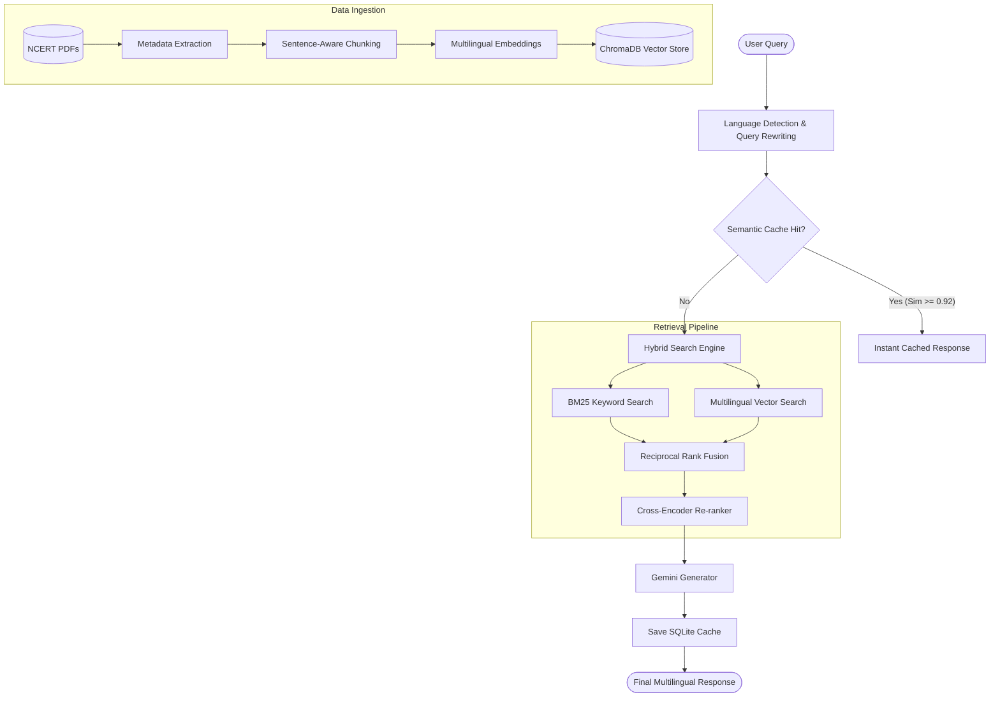

# 📚 NCERT-Mitra: Multilingual AI Learning Assistant

NCERT-Mitra is an advanced, AI-powered learning assistant designed to help students  interactively study their NCERT curriculum. Utilizing a **Retrieval-Augmented Generation (RAG)** architecture with a modern, high-performance tech stack, it performs hybrid searches, re-ranking, and semantic caching to provide accurate, context-grounded answers in both English and Hindi.

---

## 🚀 Key Features

*   **Multilingual Query Alignment & Translation:** Auto-detects query language. If a query is in English, it uses Gemini to translate it into optimized search keywords in Hindi to match the textbook index language, while generating the final response back in the user's input language.
*   **Advanced Hybrid Retrieval Pipeline:**
    *   **Dense Multilingual Vector Search:** Performs semantic search in ChromaDB using a multilingual embedding model.
    *   **Sparse Keyword Search (BM25):** Performs keyword matches using a custom localized BM25 index over textbook contents.
    *   **Reciprocal Rank Fusion (RRF):** Fuses the rankings from dense and sparse search indices.
    *   **Cross-Encoder Re-ranking:** Re-ranks the combined search candidates using a Sentence Transformers Cross-Encoder model (`cross-encoder/ms-marco-MiniLM-L-6-v2` or `BAAI/bge-reranker-base`) to filter down to the most relevant context chunks.
*   **Semantic Query Caching:** Integrates a local SQLite-based cache. It checks the cosine similarity of new queries against cached history. Similarity scores above a threshold (e.g., `0.92`) serve answers instantly, bypassing database queries and LLM generation to minimize latency and token costs.
*   **Dual Interfaces:**
    *   **Modern Web UI (FastAPI & Glassmorphic UI):** A premium, lightweight web interface utilizing CSS glassmorphism, featuring latency tracking, cache hits, and textbook subject/class metadata filtering.
    *   **Streamlit Dashboard:** A clean, sidebar-controlled interactive chat UI.
    *   **Interactive CLI:** A simple console interface for CLI-based usage.

---

## 🏛️ Project Architecture



---

## 🛠️ Tech Stack

*   **LLM API:** Google Gemini (via `google-generativeai`)
*   **Embedding Model:** `paraphrase-multilingual-MiniLM-L12-v2` (via Sentence Transformers)
*   **Re-ranking Model:** `cross-encoder/ms-marco-MiniLM-L-6-v2` or `BAAI/bge-reranker-base`
*   **Vector DB:** ChromaDB
*   **Caching Database:** SQLite3
*   **Backend & APIs:** FastAPI & Streamlit
*   **Frontend:** Vanilla HTML, CSS (Glassmorphic Theme), & JavaScript

---

## 📂 Project Structure

```
├── textbook_pdfs/         # Source NCERT textbook PDFs
├── static/                # Web interface assets (HTML, CSS, JS)
├── app.py                 # Streamlit chat interface
├── server.py              # FastAPI server serving web UI and API endpoints
├── query.py               # Interactive CLI client
├── ingest.py              # Data processing and indexing pipeline
├── retrieval_pipeline.py  # BM25 + Dense Search + RRF + Cross-Encoder
├── semantic_cache.py      # SQLite-based semantic cache logic
└── requirements.txt       # Project python dependencies
```

---

## 🚀 Getting Started

### 1. Installation & Environment Setup

1. **Clone the repository:**
   ```bash
   git clone https://github.com/your-username/ncert-mitra.git
   cd ncert-mitra
   ```

2. **Set up a virtual environment:**
   ```bash
   python -m venv .venv
   .venv\Scripts\activate  # Windows
   # source .venv/bin/activate  # macOS/Linux
   ```

3. **Install dependencies:**
   ```bash
   pip install -r requirements.txt
   ```

4. **Configure your API Key:**
   Create a `.env` file in the root directory and add your Google API key:
   ```env
   GOOGLE_API_KEY="YOUR_API_KEY"
   ```

### 2. Ingest NCERT Textbooks

Place your textbook PDFs under `textbook_pdfs/` (using NCERT prefix naming, e.g., `ihga101.pdf` for Class 6 History) and build the vector database:
```bash
python ingest.py
```

### 3. Run the Application

You can interact with NCERT-Mitra in three ways:

*   **Option A: Modern Web Client (FastAPI)**
    ```bash
    python server.py
    ```
    Open `http://localhost:8000` in your web browser.

*   **Option B: Streamlit Dashboard**
    ```bash
    streamlit run app.py
    ```

*   **Option C: Interactive CLI Interface**
    ```bash
    python query.py
    ```
